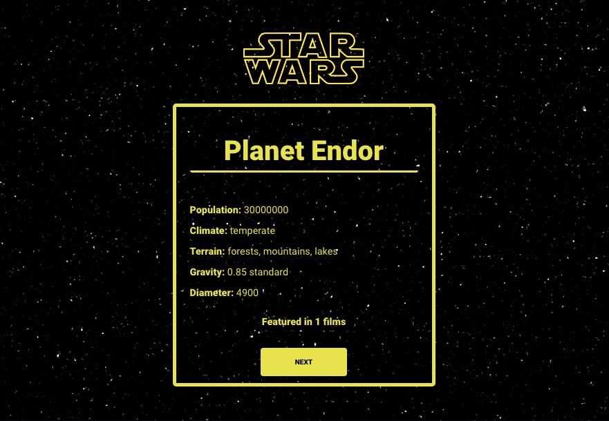

# SWAPI -  (Frontend)

Uma aplicação que utiliza da API pública SWAPI (Star Wars API) para buscar aleatoriamente informações de planetas do universo Star Wars e exibe alguns dados a respeito do mesmo.



## Instalação

##### Instalar dependências

```bash
yarn install
```

##### Rodar aplicação

```bash
yarn start
```
